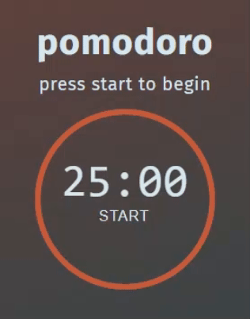

This is a small project to build a pomodoro clock for Final Project of Codedex Javascript course.

I have utilised the following tutorial to help me get started:
- https://www.codedex.io/projects/build-a-pomodoro-app-with-html-css-js

Here is a demo of how it works:

